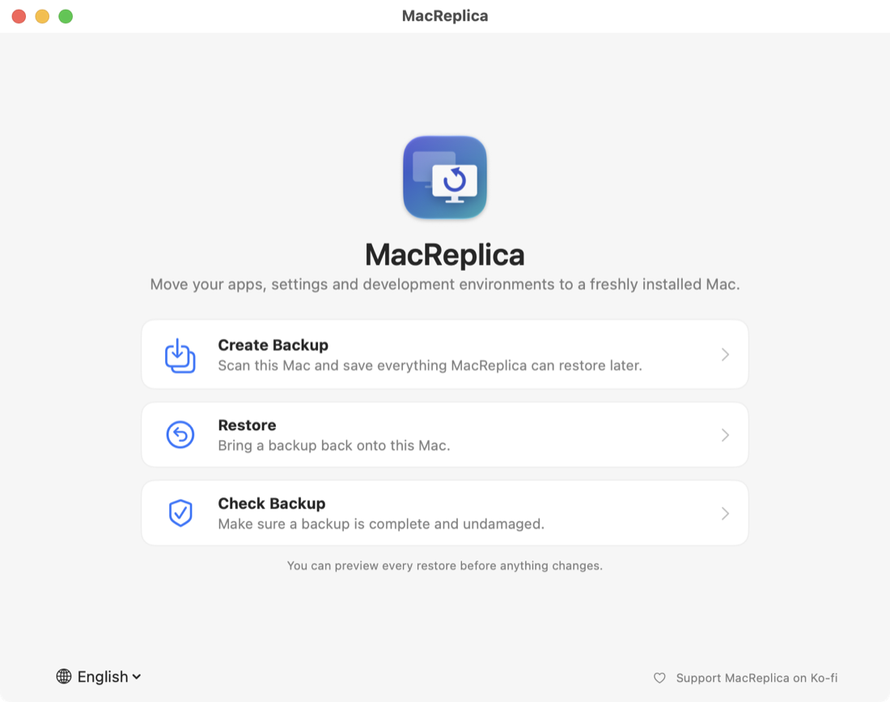
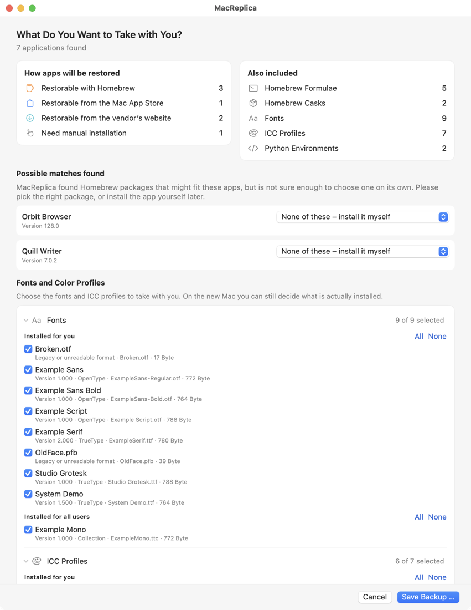
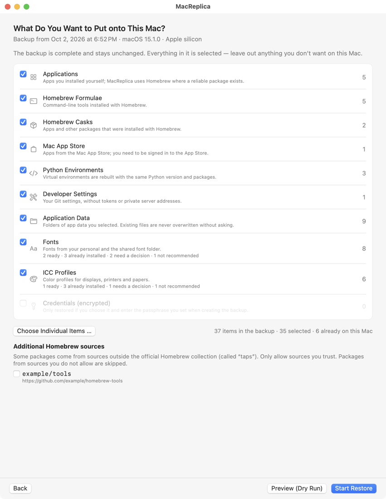
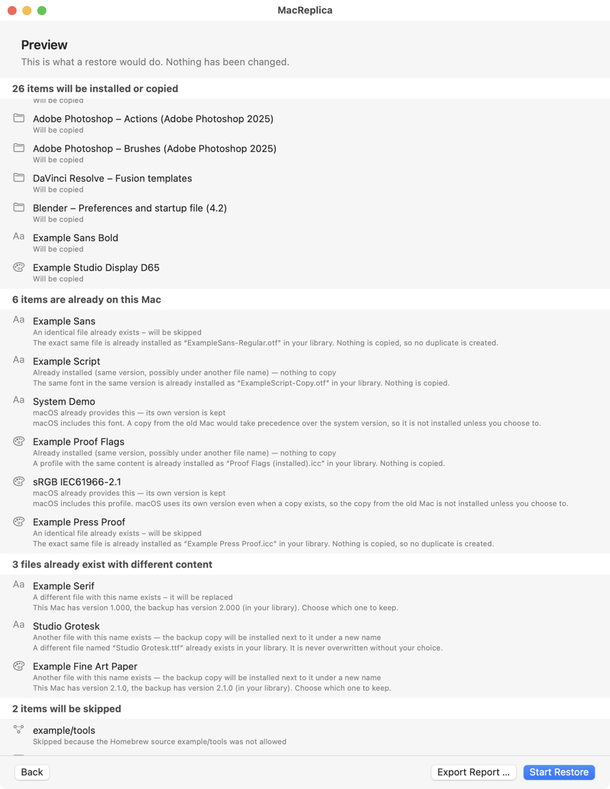
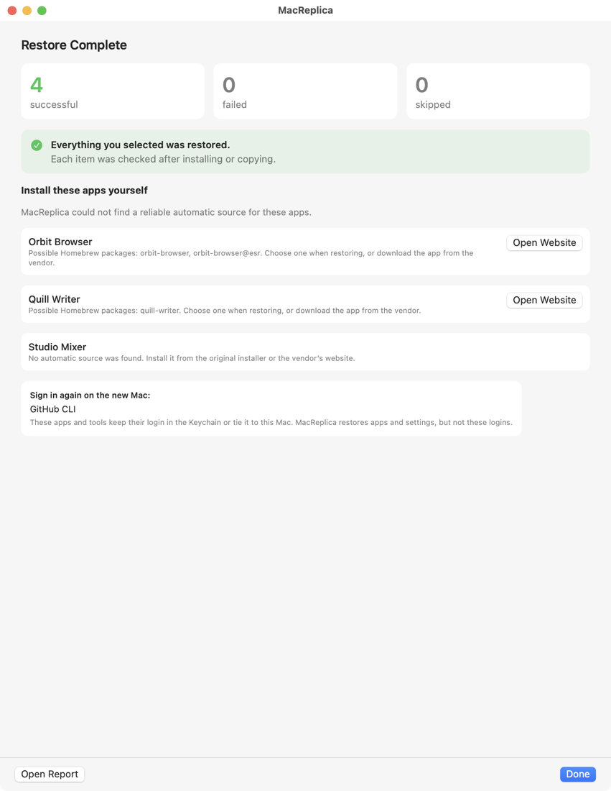
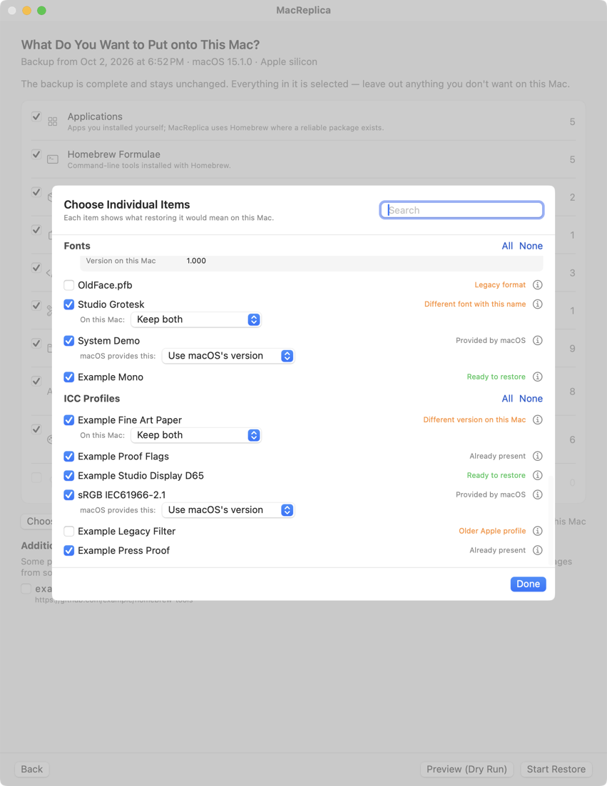
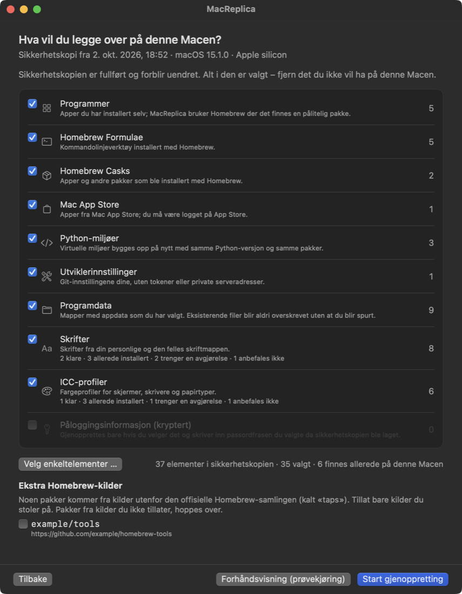

<p align="center">
  
</p>

<h1 align="center">MacReplica</h1>

<p align="center">
  Move your apps, settings and development environments to a freshly installed Mac.<br>
  A native macOS app — no Terminal needed.
</p>

<p align="center">
  
</p>

MacReplica takes stock of an old Mac, saves what can be restored into a self-contained backup
folder, and rebuilds it on a new Mac: it installs your apps again from reliable sources (Homebrew,
the Mac App Store), recreates Python environments, copies fonts, color profiles and selected app
data, and checks every single step. It does **not** clone the disk and it never copies passwords,
tokens or the Keychain.

<p align="center">
  <a href="https://ko-fi.com/itsab1989"></a>
  <br>
  <sub>MacReplica is free and always will be. If it's useful to you, a coffee is a kind way to say thanks — completely optional, and the app stays fully featured either way.</sub>
</p>

---

## Contents

- [What MacReplica does](#what-macreplica-does)
- [What it deliberately does not do](#what-it-deliberately-does-not-do)
- [Download and install](#download-and-install)
- [Using MacReplica](#using-macreplica)
- [Fonts and color profiles](#fonts-and-color-profiles)
- [Development environments and app data](#development-environments-and-app-data)
- [Credentials](#credentials)
- [Privacy and security](#privacy-and-security)
- [Languages](#languages)
- [Building from source](#building-from-source)
- [Quality: tests, mutation testing, validation](#quality-tests-mutation-testing-validation)
- [Documentation](#documentation)
- [Contributing, security reports, license](#contributing-security-reports-license)

## What MacReplica does

| Area | On the old Mac (Create Backup) | On the new Mac (Restore) |
|---|---|---|
| Apps | Lists apps in `/Applications` and `~/Applications` with version, vendor, architecture and source. Matches apps you installed by hand to Homebrew casks — conservatively, asking when several packages could fit. | Installs Homebrew casks, App Store apps (via `mas`) and lists everything that has to be installed by hand, with the vendor’s website. |
| Homebrew | Formulae, casks, taps and Homebrew’s version. | Installs the Xcode Command Line Tools and Homebrew (Homebrew’s signed installer package, team ID and checksum verified), then taps (only those you allow), formulae and casks. |
| Fonts, ICC profiles | Every font and profile, individually selectable, with identity (PostScript name and version; ICC description, class and Profile ID). | A second, destination-aware selection: what is already installed, provided by macOS, a different version, or ready — see [below](#fonts-and-color-profiles). |
| Python | Interpreters and virtual environments with their packages and project settings. | Rebuilds each environment with the same Python version and packages (environments are never copied). |
| App data and settings | Known data of 15 apps (editors, creative and productivity tools), folders you add, sanitized Git configuration, editor extension lists. | Copies data back (never underneath a running app), reports apps that need a new sign-in or a manual export. |
| Credentials (optional) | SSH keys and selected credential files — only if you opt in, encrypted with your passphrase. | Restored only with the passphrase, never logged. |

Everything ends up in one folder you can copy to an external drive or cloud folder: `manifest.json`
with checksums, the files, HTML reports and localized restore instructions.

<p align="center">
  
  &nbsp;
  
</p>

Restoring is built to be safe and repeatable:

- **Preview (Dry Run)** shows exactly what a restore would do — with the same decisions the real restore makes.
- **Resume** after an interruption or crash; finished steps are not repeated, and you can review the remaining choices first.
- **Retry failed items** later (for example after signing in to the App Store).
- **Verification of every step**: installed apps are checked on disk, copied files by checksum, fonts and profiles by macOS itself.
- **Administrator rights only when needed**, requested once through the standard macOS dialog.
- **Nothing is overwritten silently**: existing files are kept, installed next to, or moved to a *Replaced Files* folder — never deleted.

<p align="center">
  
  &nbsp;
  
</p>

## What it deliberately does not do

- No disk cloning, no copying of `/System` or whole Library folders, no system settings.
- No passwords, API keys, tokens, cookies, browser data, Keychain contents or private keys — unless
  you explicitly choose a credential provider, and then only encrypted.
- No scanning of your files for secrets.
- No downloads from unknown sources, no shell commands built from backup content, no self-updates.
  MacReplica only starts a fixed list of system tools (Homebrew, `mas`, `xcode-select`, `pkgutil`,
  `installer`, …) by absolute path, never through a shell.
- No Full Disk Access request. Locations macOS does not let MacReplica read are listed as such, with a
  button to the privacy settings if you want to grant access.

## Download and install

1. Download `MacReplica-<version>.dmg` from [Releases](https://github.com/itsab1989/MacReplica/releases).
2. Open it and drag **MacReplica** to **Applications**.
3. Double-click MacReplica. Requirements: macOS 13 Ventura or later, Apple silicon or Intel.

If a release is not notarized yet, macOS asks for confirmation the first time: open
**System Settings → Privacy & Security** and click **Open Anyway**.

## Using MacReplica

**On the old Mac**

1. Click **Create Backup**. MacReplica scans the Mac (read-only).
2. Review what was found: choose packages for apps with several possible matches, pick the fonts,
   color profiles, Python environments and app data you want to take with you, and opt in to
   credentials if you want to.
3. Click **Save Backup …** and choose a folder — ideally an external drive or a cloud folder.
4. Optionally use **Check Backup** to verify it.

**On the new Mac**

1. Copy the backup folder over, open MacReplica and click **Restore**.
2. MacReplica checks the backup and this Mac, then shows **What do you want to put onto this Mac?**:
   everything from the backup is selected; leave out what you do not want and decide conflicts.
3. Use **Preview (Dry Run)** if you like, then **Start Restore**.
4. Follow the summary: apps to install by hand, services to sign in to again, anything that failed.

The backup folder also contains `restore/RESTORE_INSTRUCTIONS.html` with the same steps and manual
commands, in the language the backup was made in.

## Fonts and color profiles

Selection happens twice: on the old Mac you choose what goes into the backup; on the new Mac you
choose what is actually installed, without having to make the backup again.

<p align="center">
  
</p>

On the new Mac every font and profile is compared with what is already there — by checksum, by font
identity (PostScript name and version) and by the computed ICC Profile ID, never by file name alone:

- **Already present / installed** — the same file or the same font/profile exists (possibly under
  another name): nothing is copied, no duplicates are created.
- **Provided by macOS** — macOS ships this font or profile; its own version is kept unless you
  explicitly choose to install the backup copy as well. MacReplica never writes into `/System`.
- **Different version on this Mac** — you choose: keep this Mac’s version (default for fonts),
  replace it with the backup (the old file is kept in *Replaced Files*), or keep both (profiles).
- **Different file with this name** — the backup copy is installed next to it under a new name by default.
- **Not recommended** — display profiles macOS generated for the old Mac’s displays (never restored),
  Apple profiles this macOS no longer ships, legacy suitcase/Type 1 fonts, unreadable files.

The rules and the research behind them (Apple and ICC documentation plus tests on current macOS)
are documented in [docs/FONTS_AND_PROFILES.md](docs/FONTS_AND_PROFILES.md).

## Development environments and app data

- **Python:** environments from Homebrew, pyenv and python.org interpreters are recorded with their
  packages (`requirements.txt`) and project files; on the new Mac they are recreated with Homebrew’s
  Python and `pip`. Packages installed from local folders or repositories are listed for manual setup.
- **App data:** providers for Visual Studio Code, Cursor, Sublime Text, JetBrains IDEs, Xcode,
  BBEdit, iTerm2, Adobe Photoshop and Camera Raw, Capture One, DaVinci Resolve, Blender, After
  Effects, Keyboard Maestro and Alfred — configuration only, never caches, databases or credential
  stores. You can add any folder inside your home folder yourself. Each provider documents its
  sources and verification status in [docs/PROVIDERS.md](docs/PROVIDERS.md).
- **Sign in again:** MacReplica recognizes tools and services that keep their login in the Keychain
  or tie it to the Mac (GitHub CLI, Docker, cloud CLIs, Adobe Creative Cloud, Microsoft 365, Dropbox,
  Slack, …) and lists them for a new sign-in instead of copying anything.

## Credentials

Credential migration is **off by default** and only available through specific providers (SSH keys,
AWS, Git credentials, npm, Kubernetes, Terraform). If you opt in, the files are encrypted in the
backup with AES-256-GCM using a key derived from your passphrase (PBKDF2-HMAC-SHA256, 600,000
iterations). The passphrase is never stored. Credentials never appear in logs, reports, the normal
manifest or screenshots.

## Privacy and security

- Logs, reports and manifests write your home folder as `~` and contain no account names, serial
  numbers or device identifiers.
- MacReplica has no analytics. It makes only three kinds of network requests itself: Homebrew’s
  public cask list (to match apps you installed by hand), the optional update check (GitHub Releases
  API) and, during a restore, Homebrew’s official installer package. Everything else is downloaded
  by Homebrew and the App Store.
- Clean-up only ever removes folders MacReplica created and marked as its own.

See [SECURITY.md](SECURITY.md) for the threat model and how to report a vulnerability.

## Languages

English (default), Deutsch, Norsk bokmål, Français, Español, Italiano and Nederlands. Change the
language in the app (bottom left on the start screen or in Settings).

<p align="center">
  
</p>

## Building from source

Requirements: macOS 13+, the Xcode Command Line Tools (Xcode is not required), Swift 6.1+.

```sh
scripts/test.sh                 # build and run all tests
scripts/build-app.sh build      # universal MacReplica.app in ./build (ad-hoc signed)
scripts/make-dmg.sh build       # MacReplica-<version>.dmg next to it
```

Signing and notarization with a Developer ID are described in [docs/BUILDING.md](docs/BUILDING.md).
For development and testing without touching your own Mac, MacReplica can run against a
**simulated Mac** (`--simulation-root`, see [docs/VALIDATION.md](docs/VALIDATION.md)).

## Quality: tests, mutation testing, validation

- 296 automated tests (unit, integration, end-to-end restore on simulated Macs, failure modes,
  security, localization parity) with synthetic test data only.
- Mutation testing of the critical modules with documented scores — [docs/MUTATION_TESTING.md](docs/MUTATION_TESTING.md).
- Failure-mode review — [docs/FAILURE_MODES.md](docs/FAILURE_MODES.md).
- On-device validation of the real app (light/dark, narrow windows, several languages) —
  [docs/VALIDATION.md](docs/VALIDATION.md).

## Documentation

| Document | Content |
|---|---|
| [docs/USER_GUIDE.md](docs/USER_GUIDE.md) | Step-by-step guide, backup folder layout, troubleshooting |
| [docs/ARCHITECTURE.md](docs/ARCHITECTURE.md) | Modules, data flow, manifest format, extension points |
| [docs/FONTS_AND_PROFILES.md](docs/FONTS_AND_PROFILES.md) | Two-stage selection, conflict policy and evidence |
| [docs/PROVIDERS.md](docs/PROVIDERS.md) | App data, credential and re-authentication providers with sources |
| [docs/RESEARCH_REPORT.md](docs/RESEARCH_REPORT.md) | Engineering research report and roadmap |
| [docs/FAILURE_MODES.md](docs/FAILURE_MODES.md) | What can go wrong and how MacReplica handles it |
| [docs/MUTATION_TESTING.md](docs/MUTATION_TESTING.md) | Mutation testing method and results |
| [docs/VALIDATION.md](docs/VALIDATION.md) | Simulation environment and on-device validation |
| [docs/BUILDING.md](docs/BUILDING.md) | Building, signing, notarizing and releasing |
| [docs/examples/](docs/examples/) | Example manifest and reports (synthetic data) |

## Contributing, security reports, license

Contributions are welcome — see [CONTRIBUTING.md](CONTRIBUTING.md). Please report security issues
privately as described in [SECURITY.md](SECURITY.md).

MacReplica is licensed under the [GNU General Public License v3.0](LICENSE).
Homebrew, Mac App Store, macOS and all app names are trademarks of their respective owners;
MacReplica is not affiliated with them.
